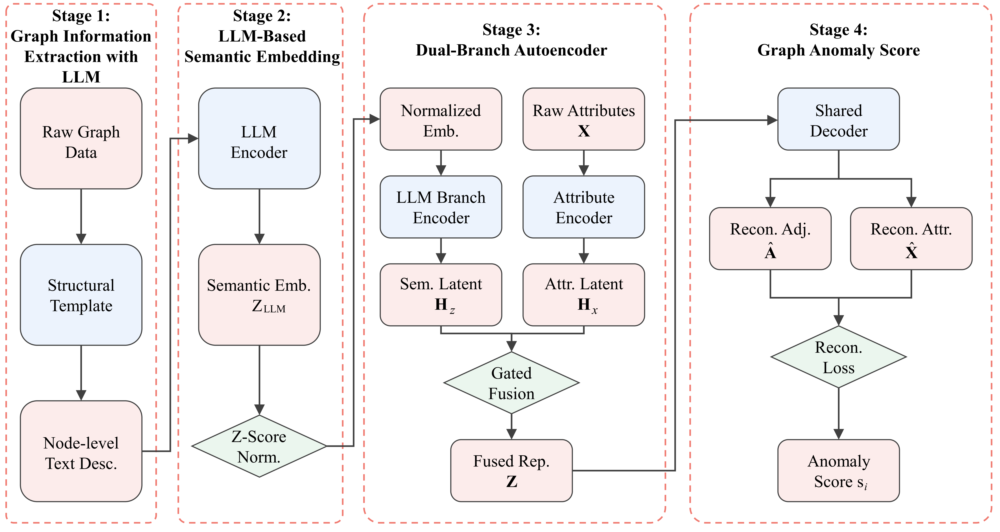

# This is the official code for TERGAD

### Architecture


## Abstract <a id="abstract"></a>
Graph anomaly detection (GAD) aims to identify atypical graph objects—such as nodes, edges, or substructures—that significantly deviate from the majority. 
While existing text-rich approaches typically enrich node semantics with textual features, they often neglect the structural context of nodes, limiting their ability to detect anomalies arising from inconsistencies between node content and structural roles.
To address this issue, we propose \textbf{TERGAD} (Structure-Aware Text-Enhanced Representation for Graph Anomaly Detection), a novel framework that incorporates structural semantics into text-rich GAD via the semantic reasoning capabilities of large language models (LLMs). 
TERGAD first translates node-level structural properties into natural language descriptions, then derives semantic node embeddings via an LLM. 
These embeddings are adaptively fused with original node attributes through a gated dual-branch autoencoder to jointly reconstruct both graph structure and node attributes. 
The anomaly score is computed as the combined reconstruction error, reflecting deviations in both observable features and LLM-informed semantic expectations. 
Extensive experiments on real-world datasets demonstrate that TERGAD consistently outperforms state-of-the-art GAD methods, with ablation studies validating the critical role of structural semantic guidance and gated fusion. 

## Environment Setup
Install requirements.txt
```
conda install --file requirements.txt
```


# Step 1: Generate structured JSON descriptions
python tojson.py

# Step 2: Generate node embeddings using LLM
In this document, you can also use different large language models.
python askbge.py

# Step 3: Train TERGAD for anomaly detection
run the code for training Graph Anomaly Detection

```
python train.py --dataset citeseer.mat --npy ./bge_nodes_embedding/citeseer.npy

python train.py --dataset pubmed.mat --npy ./bge_nodes_embedding/pubmed.npy
...
```


